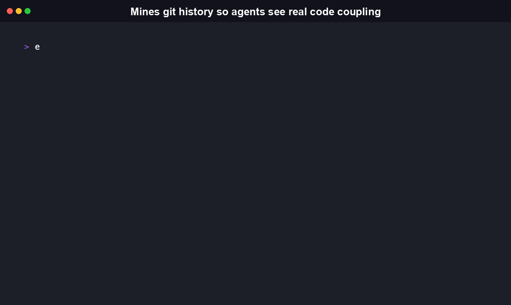
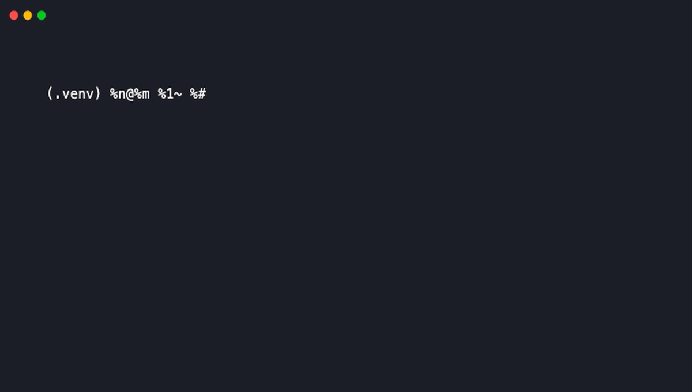
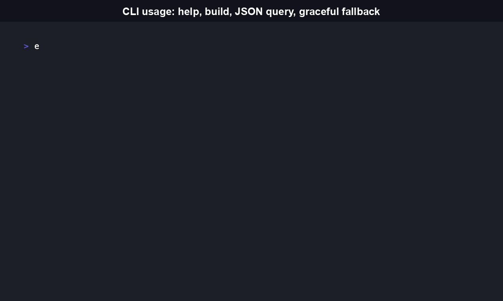

<div align="center">

# GraphKeeper

[](https://www.npmjs.com/package/graphkeeper-cli)
[](https://pypi.org/project/graphkeeper-cli/)
[](https://www.npmjs.com/package/graphkeeper-cli)
[](./LICENSE)

[Install](#install) • [Quickstart](#quickstart) • [CLI Reference](#cli-reference) • [Comparison](#comparison) • [FAQ](#faq)

A local-only CLI that mines your `git log` for which files actually change
together, then hands an AI coding agent a queryable answer instead of a
grep across the whole history.



</div>

```bash
npx graphkeeper-cli build
npx graphkeeper-cli query co-change src/git.ts
```

```
Files that historically change alongside "src/git.ts":

     1  src/store.ts
     1  src/types.ts
     1  test/git.test.ts
     1  test/store.test.ts
     1  test/test-helpers.ts
```

(Real output from running GraphKeeper against its own repo, this early in its
history. Co-change counts grow as a codebase accumulates more commits.)

No server, no account, no embeddings API. Every byte of output comes from
`git log` on the repo you already have checked out.

## Install

GraphKeeper ships two independent, equally first-class packages. Pick
whichever fits your toolchain, or install both. Both mine the same `git
log` co-change signal and share one on-disk `.graphkeeper/graph.json`
schema, so a store built by either can be read back by the other.

```bash
# npm -- JavaScript/TypeScript CLI + library
npm install -g graphkeeper-cli
# or run it once with no install
npx graphkeeper-cli build

# PyPI -- Python CLI + library (genuine port, not a wrapper around the Node binary)
pip install graphkeeper-cli
```

The npm package requires Node.js 18 or later; the Python package requires
Python 3.9 or later. Both require `git` on your `PATH`. The Python
package's CLI entry point is also `graphkeeper` (e.g. `graphkeeper build`).
See [`python/README.md`](./python/README.md) for the Python-specific
walkthrough, and [CHANGELOG.md](./CHANGELOG.md) for each distribution's
version history.

## Quickstart

Run it against any git repo, including this one:

```bash
git clone https://github.com/RudrenduPaul/GraphKeeper.git
cd GraphKeeper
graphkeeper build
```

```
GraphKeeper build complete: /path/to/GraphKeeper

Co-change graph: 4 commit(s) analyzed, 80 file pair(s) found
graphify enrichment: skipped -- graphify was not found on PATH. Install it with
`uv tool install graphifyy` (or `pipx install graphifyy`) for symbol/call-graph
enrichment; GraphKeeper works fine without it, in co-change-only mode.

Wrote /path/to/GraphKeeper/.graphkeeper/graph.json
```

Now query it:

```bash
graphkeeper query co-change src/git.ts
```

```
Files that historically change alongside "src/git.ts":

     1  src/store.ts
     1  src/types.ts
     1  test/git.test.ts
     1  test/store.test.ts
     1  test/test-helpers.ts
```

If [graphify](https://github.com/Graphify-Labs/graphify) is installed
(`uv tool install graphifyy`), `graphkeeper build` automatically shells out to
its local, no-API-key `graphify extract --code-only` and merges its
symbol/call-graph into the same store, unlocking call-graph queries:

```bash
graphkeeper query calls mineCoChange
```

```
mineCoChange() (src/git.ts)

Calls (2):
  --> assertIsGitRepo()
  --> runGit()

Called by (1):
  <-- build()
```

(Also real output, from running `graphkeeper build` against this repo with
graphify installed.)



Without graphify installed, that same command explains exactly why the
answer isn't available instead of crashing or returning an empty result:

```
Call-graph query for "mineCoChange" is not available.

graphify was not found on PATH. Install it with `uv tool install graphifyy`
(or `pipx install graphifyy`) for symbol/call-graph enrichment; GraphKeeper
works fine without it, in co-change-only mode.
```

Every command also supports `--json` for scripts and agents:

```bash
graphkeeper query co-change src/git.ts --json
```

```json
{
  "file": "src/git.ts",
  "results": [
    { "file": "src/store.ts", "count": 1 },
    { "file": "src/types.ts", "count": 1 },
    { "file": "test/git.test.ts", "count": 1 },
    { "file": "test/store.test.ts", "count": 1 },
    { "file": "test/test-helpers.ts", "count": 1 }
  ]
}
```



## Features

- **Mines real commit history, not a static snapshot.** `graphkeeper build`
  runs `git log --no-merges --name-only` across the full history of the
  repo and counts every file pair that changed together in the same
  commit. There's no guessing at coupling from folder structure or import
  statements alone; the answer comes from how the codebase actually got
  edited over time.
- **`--max-files-per-commit` protects the signal.** A single vendoring
  commit or mass reformat that touches 400 files would otherwise pollute
  every pair in that commit. The default cap (100 files) skips commits
  above that threshold so real coupling doesn't drown in noise.
- **Optional call-graph enrichment, never required.** When
  [graphify](https://github.com/Graphify-Labs/graphify) is on `PATH`,
  `graphkeeper build` shells out to its local `graphify extract
  --code-only --no-cluster` and merges the resulting symbol/call edges into
  the same store, unlocking `graphkeeper query calls`. Without graphify,
  GraphKeeper still works in co-change-only mode and says so plainly
  instead of failing.
- **Every command has a `--json` mode.** `graphkeeper query co-change
  <file> --json` and the equivalents return machine-readable output, so an
  agent's calling code parses a real data structure instead of scraping
  text.
- **Two from-scratch implementations, one schema.** The npm package
  (`src/`, TypeScript) and the PyPI package (`python/src/graphkeeper/`,
  Python) are independent ports, not a wrapper of one around the other.
  Both read and write the same `.graphkeeper/graph.json`, so a store built
  with one CLI is queryable from the other.
- **Every subprocess call uses an argv array, never a shell string.** Git
  and graphify are both invoked through `spawnSync`/`subprocess.run` with
  a list of arguments, so a crafted commit message or filename in the repo
  being analyzed can't be interpreted as shell syntax.

## CLI Reference

```
Usage: graphkeeper [options] [command]

Options:
  -V, --version           output the version number
  -h, --help              display help for command

Commands:
  build [options] [path]  Mine git history for co-change and (if available)
                          merge in graphify's symbol/call graph
  query                   Query the GraphKeeper store built by
                          `graphkeeper build`
  help [command]          display help for command
```

### `graphkeeper build [path]`

Walks `path` (default: current directory), runs `git log --no-merges
--name-only` across the whole history, and counts how often each pair of
files was touched in the same commit. Writes the result to
`.graphkeeper/graph.json`.

| Option | Description |
|---|---|
| `--json` | emit machine-readable JSON instead of human-readable text |
| `--max-files-per-commit <n>` | skip commits touching more than this many files (default: 100), keeping a single mass-reformat or vendoring commit from drowning out real co-change signal |
| `--no-graphify` | skip graphify enrichment even if graphify is installed |

If [graphify](https://github.com/Graphify-Labs/graphify) is detected on
`PATH`, `build` also runs `graphify extract <path> --code-only --no-cluster`
(graphify's own headless, local, no-API-key AST extraction path) into a
directory inside `.graphkeeper/`, and merges its nodes/edges into the same
store. The build output always states plainly whether that enrichment was
included, and why it was skipped if not.

### `graphkeeper query co-change <file>`

Lists files that historically changed alongside `<file>`, ranked by how many
commits touched both.

| Option | Description |
|---|---|
| `--json` | emit machine-readable JSON instead of human-readable text |
| `--limit <n>` | cap the number of results |
| `--graph <path>` | path to a specific `graph.json` (default: `<cwd>/.graphkeeper/graph.json`) |

Exit code `0` when results are found, `1` when there's no co-change data for
that file yet, `2` on a usage or filesystem error.

### `graphkeeper query calls <symbol>`

Shows callers and callees of `<symbol>`, using graphify's `calls` edges from
the most recent `build`. Only meaningful when that build included graphify
enrichment; if it didn't, this prints a clear explanation of why instead of
a crash or a silent empty result.

| Option | Description |
|---|---|
| `--json` | emit machine-readable JSON instead of human-readable text |
| `--graph <path>` | path to a specific `graph.json` (default: `<cwd>/.graphkeeper/graph.json`) |

Exit code `0` when the symbol is found, `1` when it isn't (or enrichment
wasn't available), `2` on a usage or filesystem error.

## Library API Reference

Both packages expose a real importable surface, listed below. The command
line is a thin wrapper over the same functions.

### TypeScript / JavaScript (`graphkeeper-cli` on npm)

```ts
import { build, queryCoChange } from "graphkeeper-cli";

const result = build(".");
console.log(`${result.store.commitsAnalyzed} commit(s) analyzed`);

const coChange = queryCoChange(result.store, "src/git.ts");
for (const row of coChange.results) {
  console.log(row.count, row.file);
}
```

| Export | Signature |
|---|---|
| `build` | `build(targetPath: string, options?: BuildOptions): BuildResult` |
| `queryCoChange` | `queryCoChange(store: GraphKeeperStore, file: string, options?: { limit?: number }): CoChangeQueryResult` |
| `queryCalls` | `queryCalls(store: GraphKeeperStore, symbol: string): CallsQueryResult` |
| `findGraphifyNode` | `findGraphifyNode(nodes: GraphifyNode[], symbol: string): GraphifyNode \| null` |
| `normalizeFileArg` | `normalizeFileArg(store: GraphKeeperStore, file: string): string` |
| `detectGraphify` | `detectGraphify(): { installed: boolean; version: string \| null }` |
| `runGraphifyEnrichment` | `runGraphifyEnrichment(repoRoot: string): GraphifyEnrichment` |
| `mineCoChange` | `mineCoChange(repoPath: string, options?: { maxFilesPerCommit?: number }): CoChangeMiningResult` |
| `GitError` | Error subclass thrown on a git-related failure |
| `resolveRepoRoot` | `resolveRepoRoot(targetPath: string): string` |
| `readStore` | `readStore(repoRoot: string, overridePath?: string): GraphKeeperStore` |
| `writeStore` | `writeStore(repoRoot: string, store: GraphKeeperStore): string` |
| `PathSafetyError` | Error subclass thrown when a resolved path escapes the repo root |
| `graphFilePath` | `graphFilePath(repoRoot: string): string` |

Types (`GraphKeeperStore`, `CoChangeEdge`, `GraphifyNode`, `GraphifyEdge`,
`GraphifyRawGraph`, `GraphifyEnrichment`, `BuildOptions`, `BuildResult`,
`CoChangeQueryResult`, `CallsQueryResult`) ship as `.d.ts` declarations
alongside the compiled output; no separate generated docs site exists yet.

### Python (`graphkeeper-cli` on PyPI)

```python
from graphkeeper import build, query_co_change

result = build(".")
print(f"{result.store.commits_analyzed} commit(s) analyzed")

co_change = query_co_change(result.store, "src/git.py")
for row in co_change.results:
    print(row.count, row.file)
```

`graphkeeper.__all__` exports: `build`, `query_co_change`, `query_calls`,
`find_graphify_node`, `normalize_file_arg`, `detect_graphify`,
`run_graphify_enrichment`, `mine_co_change`, `unquote_git_path`, `GitError`,
`resolve_repo_root`, `read_store`, `write_store`, `graph_file_path`,
`PathSafetyError`, plus the `GraphKeeperStore`, `CoChangeEdge`,
`GraphifyNode`, `GraphifyEdge`, `GraphifyEnrichment`, `BuildOptions`,
`BuildResult`, `CoChangeQueryResult`, `CoChangeResultRow`, and
`CallsQueryResult` dataclasses. Same names as the TypeScript export table
above, in `snake_case`. No separate generated docs site exists yet; the
docstring at the top of `python/src/graphkeeper/__init__.py` covers the
same ground as this section.

## Comparison

| | GraphKeeper | graphify | GitNexus | Greptile | Augment Code |
|---|---|---|---|---|---|
| What it does | Mines `git log` for file-level co-change | Symbol/import/call-graph extraction via tree-sitter, AI-assistant skill | CLI + MCP tools (native, local) with an optional no-install browser/WASM mode; structural + call-flow analysis | Hosted AI code review with a graph-indexed codebase | Hosted AI coding platform with a live code dependency graph (Context Engine), plus commit-history and docs indexing |
| Local-only? | Yes, always | Yes, for code parsing (docs/media indexing calls a backend if configured) | Yes for the CLI/MCP path; the browser mode runs client-side but needs the hosted web app | No by default; self-hosted/air-gapped is available on the Enterprise tier only | No; cloud-hosted, no self-host option publicly documented |
| Free/OSS? | Yes, Apache-2.0 | Yes, Apache-2.0 | No, PolyForm Noncommercial 1.0.0 | Free Starter tier (1 seat, 50 credits/month), not open source | Not publicly documented as free; enterprise sales-led pricing |
| Co-change mining? | Yes, this is the whole tool | No | No | No | No |
| GraphKeeper's relationship | -- | GraphKeeper enriches its own store from graphify's local `extract` output when graphify is installed; doesn't reimplement it | Different delivery model (CLI+MCP+optional browser app vs. this project's plain CLI); no co-change mining | Team/PR-review focused, hosted product, not a local single-agent tool | Enterprise coding-assistant platform, not a standalone local CLI |

("Not publicly documented" is used instead of a guess anywhere a competitor
doesn't publish the number. Verified against each project's own README,
pricing page, or public site as of August 2026.)

## What Is GraphKeeper, and Why Does It Exist

GraphKeeper is a local CLI and library, published to both npm and PyPI as
`graphkeeper-cli`, that mines `git log` for file-level co-change: which
files have historically been edited in the same commit as a given file.
It writes that data to a single JSON file, `.graphkeeper/graph.json`, and
answers queries against it with no network calls.

It exists because an AI coding agent working solo on a codebase it doesn't
already know well has no fast way to answer "what else usually changes
when I touch this file?" without running its own `git log --name-only`
scan and tallying the results by hand, every time it's asked. GraphKeeper
precomputes that answer once and makes it queryable, including in a
`--json` form a script or agent can parse directly.

GraphKeeper does not reimplement symbol or call-graph extraction.
[graphify](https://github.com/Graphify-Labs/graphify) (100K+ GitHub stars,
Apache-2.0, `pip install graphifyy`) already does that across 36
tree-sitter grammars and ships as a slash-command skill for Claude Code,
Cursor, Codex, Gemini CLI, GitHub Copilot, and 15+ more assistants (20+
total). When graphify is on `PATH`, `graphkeeper build` shells out to its
local `graphify extract --code-only --no-cluster` and merges the result
into the same store, unlocking `graphkeeper query calls`. Without graphify,
GraphKeeper still works, in co-change-only mode, and says so directly
instead of failing.

## How It Works

1. `graphkeeper build` runs `git log --no-merges --name-only` (via a safe
   argv-array subprocess call, never a shell string) across the whole
   repo history.
2. For every commit, it counts every pair of files that changed together.
   Commits touching more than `--max-files-per-commit` files (default 100)
   are skipped, so a single vendoring or mass-reformat commit can't drown
   out real signal.
3. If `graphify` is detected on `PATH`, GraphKeeper also runs
   `graphify extract <path> --code-only --no-cluster`, graphify's own
   local, no-LLM, no-API-key extraction mode, into a directory inside
   `.graphkeeper/`, then merges its `nodes`/`edges` into the same store.
4. The merged result is written once, atomically, to
   `.graphkeeper/graph.json`.
5. `graphkeeper query` reads that file back and answers co-change or
   call-graph questions against it. No network calls, ever.

## Security

- Every `git` and `graphify` invocation uses an argv array passed directly
  to the OS (`spawnSync` in TypeScript, `subprocess.run` with a list in
  Python), never a shell string, so commit messages, file names, or repo
  paths can't be interpreted as shell syntax.
- `.graphkeeper/` output paths are checked against the resolved repo root
  before every write (symlinks included, via `fs.realpathSync`), so a
  maliciously crafted repo can't redirect GraphKeeper's writes outside
  `.graphkeeper/`.
- No telemetry, no network calls, no secrets. The only files GraphKeeper
  reads are `git log` output and, optionally, graphify's own `graph.json`;
  the only file it writes is `.graphkeeper/graph.json`.

See [SECURITY.md](./SECURITY.md) for the vulnerability reporting process.

## FAQ

**Is GraphKeeper a general codebase knowledge-graph indexer?**

Not on its own. `graphkeeper build` mines `git log` for file-level
co-change and writes those edges to `.graphkeeper/graph.json`. That file
only becomes a symbol/call graph too if graphify is installed and gets
merged in during the same build. Without graphify on `PATH`, the store
holds co-change data only, and `graphkeeper query calls` says so directly
instead of returning an empty result.

**What does GraphKeeper actually give an agent that grep or git log don't?**

A pre-computed, queryable answer to "which files change together here,"
so an agent doesn't have to run its own `git log --name-only` scan and
tally the results by hand on every question. `--json` on every command
makes that answer script-consumable rather than something a human has to
read and re-type.

**How do I install it, and does it work on Windows?**

`npm install -g graphkeeper-cli` (Node.js 18+) or `pip install
graphkeeper-cli` (Python 3.9+); both need `git` on `PATH`. Neither
package contains OS-specific branches or native bindings, and the PyPI
listing is classified `Operating System :: OS Independent`, so it runs
the same way on Windows, macOS, and Linux anywhere git and a supported
Node or Python runtime are available.

**How is this different from graphify, the tool it links to for enrichment?**

They answer different questions. graphify extracts symbols, imports, and
call graphs straight from source via tree-sitter, across 36 languages;
GraphKeeper mines commit history for which files were historically
edited together, a signal graphify has no reason to compute. GraphKeeper
shells out to graphify's own local `extract` command when it's present
and merges the result in, rather than reimplementing tree-sitter parsing
from scratch. Neither replaces the other; see the Comparison table above
for how GitNexus, Greptile, and Augment Code differ from both.

**What actually breaks GraphKeeper, or gives an empty result?**

Two real cases, both documented, neither a crash: a shallow git clone
(GitHub Actions' default `fetch-depth: 1`) has no history to mine, so
`build` reports `0 commit(s) analyzed` and writes an empty co-change
graph; full history (`fetch-depth: 0`) is required. Separately,
`query calls` only returns results if the most recent `build` ran with
graphify on `PATH`; if it didn't, the command explains that plainly
(`graphify was not found on PATH...`) instead of pretending the symbol
doesn't exist.

**Is it safe to run against a repo I don't fully trust?**

Every `git` and `graphify` call goes through an argv array straight to
the OS (`spawnSync` / Python's `subprocess.run` with a list, never a
shell string), so filenames or commit messages can't be interpreted as
shell syntax. Every `.graphkeeper/` write is checked against the
resolved repo root, symlinks included, before it happens. There are no
network calls anywhere in the tool, so nothing about the repo you point
it at leaves your machine.

**Is the npm CLI just a wrapper around the Python one, or vice versa?**

Neither. They're two independent, from-scratch implementations (`src/`
for TypeScript, `python/src/graphkeeper/` for Python) that happen to
agree on the same `.graphkeeper/graph.json` schema, the same subcommands,
flags, and exit codes. A store built by one can be read by the other.
The Python port's own test suite (ported from the TypeScript vitest
suite) is 78 tests, run against a real subprocess CLI invocation, not a
mock of the other language's output. Both suites pass in a clean install
as of this writing: 78/78 on the TypeScript side (`npm test`), 78/78 on
the Python side (`pytest`).

**What license is this under, and can I use it commercially?**

Apache License 2.0, for both the npm and PyPI packages, with no dual
licensing and no separate commercial tier. That permits commercial use,
modification, and redistribution, with attribution and the standard
Apache patent grant. See [LICENSE](./LICENSE) for the full text.

## Contributing

Issues and PRs welcome. To build the TypeScript package from source:

```bash
git clone https://github.com/RudrenduPaul/GraphKeeper.git
cd GraphKeeper
npm install
npm run build
npm test
npm run lint
npm run typecheck
```

For the Python package, see [`python/README.md`](./python/README.md). Full
contribution guidelines covering both codebases are in
[CONTRIBUTING.md](./CONTRIBUTING.md).

## License

[Apache License 2.0](./LICENSE)
